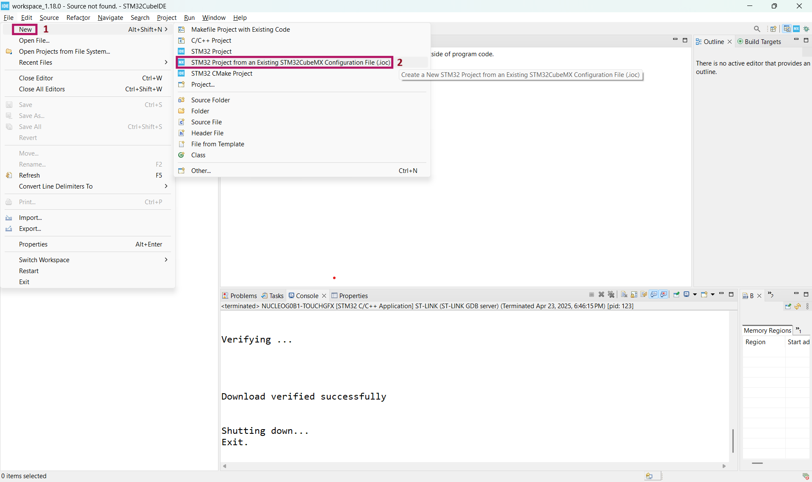
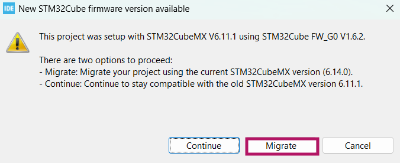
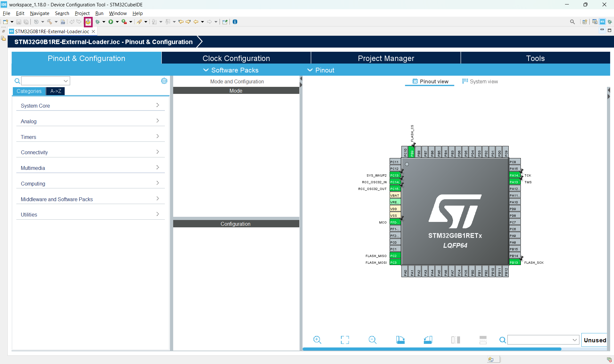
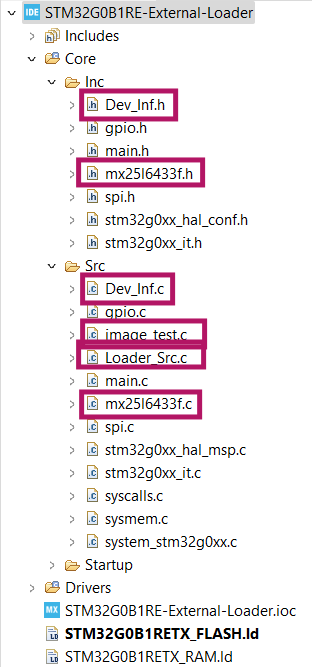
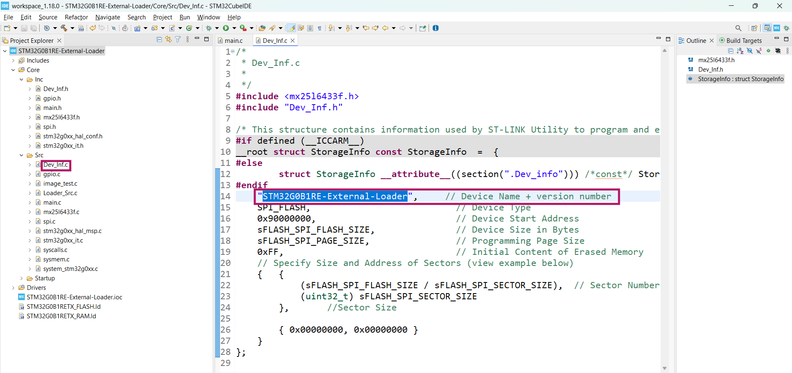
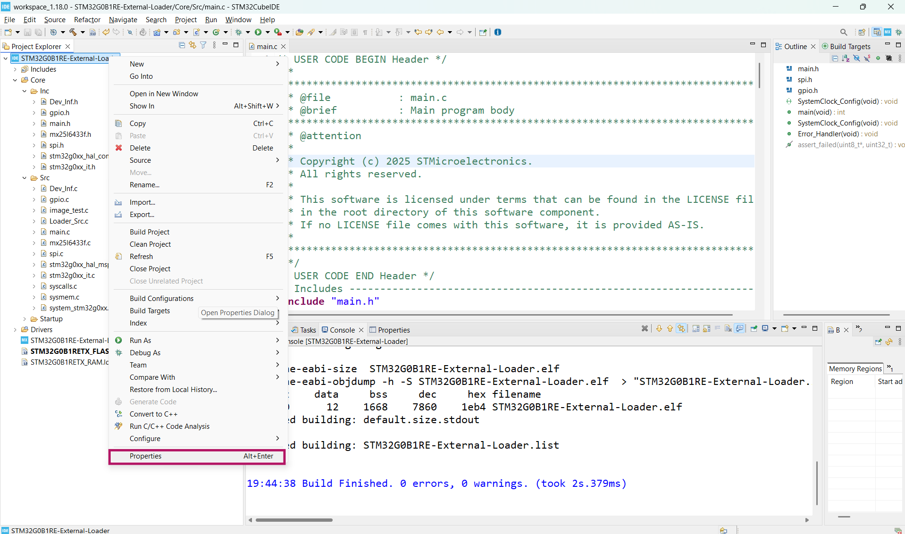
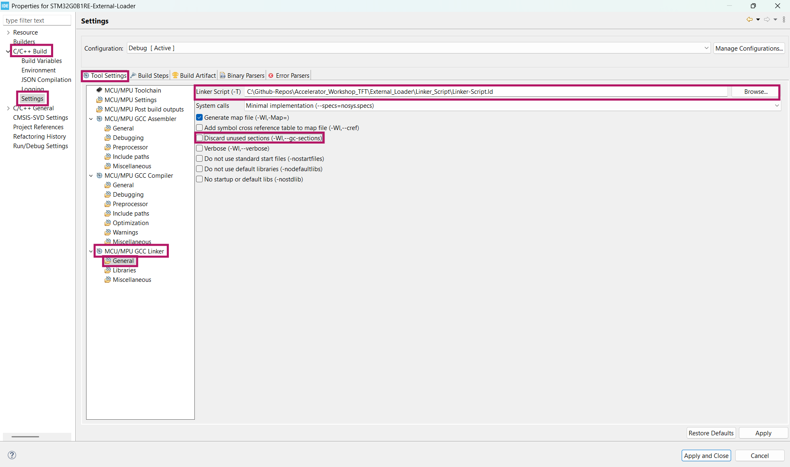
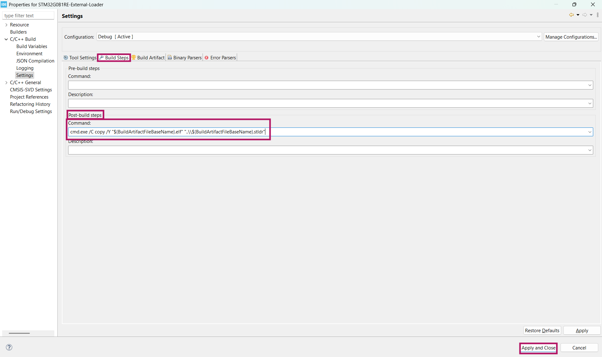

# 🛠️ External Loader Hazırlama

## External Loader Nedir?

External Loader, STM32CubeProgrammer tarafından harici flash bellekleri programlamak için kullanılan özel bir yazılım modülüdür. STM32 mikrodenetleyiciler, genellikle harici SPI NOR flash gibi belleklerle çalışabilir. Bu loader, bu tür harici belleklerin programlanabilmesini sağlar.

Burada, STM32G0B1RE mikrodenetleyicisi ile MX25L6433F SPI flash kullanılarak external loader hazırlama yöntemi gösterilmektedir.

### Proje Yapılandırması

MCU: STM32G0B1RE

Harici Flash: MX25L6433F (SPI NOR Flash)

IDE: STM32CubeIDE

## Proje Oluşturma

Öncelikle şekilde gösterildiği gibi STM32CubeIDE içerisinden New(1)->STM32 Project from an Existing STM32CubeMX Configuration File(.ioc)(2) seçeneğini seçin.



Ardından açılan ekranda [IOC](IOC/) klasöründe bulunan [STM32G0B1RE-Ext-Loader.ioc](IOC/STM32G0B1RE-Ext-Loader.ioc) dosyasını seçin, proje ismini değiştirin ve finish'e tıklayarak projenizi oluşturun.


Ardından açılan ekranda **Migrate** seçeneğini seçin.



Sizi şekildeki gibi ioc dosyası karşılayacaktır burada işaretli olan **Device Configuration Tool Code Generation** seçeneğine tıklayın.



## Kütüphane Ekleme

Projeyi kullanmaya başlamadan önce gerekli sürücü dosyalarını STM32 projenize dahil etmeniz gerekir. Bunun için aşağıdaki adımları izleyin:

1. Bu repoda yer alan [Drivers/Inc](Drivers/Inc/) klasöründeki tüm dosyaları kendi STM32 projenizdeki `Core/Inc` klasörüne kopyalayın.

2. Aynı şekilde, [Drivers/Src](Drivers/Src/) klasöründeki tüm dosyaları da `Core/Src` klasörüne kopyalayın.

Bu adımlar, proje içinde gerekli olan .h ve .c dosyaların doğru şekilde yerleştirilmesini sağlayacaktır.

Aşağıdaki ekran görüntüsü, dosyaların nasıl yerleştirilmesi gerektiğini örneklemektedir:



## Kod Entegrasyonu

➡Bu adımda, harici SPI Flash belleğin doğru çalıştığını test etmek için gerekli kodları uygun yerlere ekleyeceğiz. Kod, main.c dosyasında belirli yorum satırları arasına eklenerek çalıştırılmalıdır.

### 1. Gerekli Kütüphanelerin Dahil Edilmesi
```c
/* USER CODE BEGIN Includes */
/* USER CODE END Includes */
```
yorum satırları arasına 

```c
#include <string.h>
#include "mx25l6433f.h"
```
satırlarını kopyalayın.

### 2. Değişkenlerin Tanımlanması
```c
/* USER CODE BEGIN PV */
/* USER CODE END PV */
```
yorum satırları arasına

```c
extern unsigned char image_test[57600];
uint8_t sector_data[sFLASH_SPI_SECTOR_SIZE];
uint32_t errorCount;
```
satırlarını kopyalayın.

### 3. Karşılaştırma Fonksiyonunun Eklenmesi
```c
/* USER CODE BEGIN PFP */
/* USER CODE END PFP */
```
yorum satırları arasına 

```c
int my_memcmp(void *dest, void *src, int size) {
	unsigned char *p = dest;
	unsigned char *q = src;

	while (size > 0) {
		if (*p != *q) {
			return (*p - *q);
		}
		size--;
		p++;
		q++;
	}
	return 0;
}
```
satırlarını kopyalayın.

### 4. Sektör Sayacı ve Bellek Hesaplamaları İçin Değişkenler
```c
  /* USER CODE BEGIN 1 */
    /* USER CODE END 1 */
```
satırları arasına 
```c
	uint32_t sectorsNeeded = 0;
	uint32_t currentSector = 0;
	uint32_t remainingBytes = 0;
```
satırlarını kopyalayın.

### 5. SPI Flash Okuma/Yazma Testinin Eklenmesi
```c
  /* USER CODE BEGIN 2 */
    /* USER CODE END 2 */
```
yorum satırları arasına 
```c
 if (sFLASH_MX25L6433F_ID != sFLASH_ReadID()) {
  		Error_Handler();
  	}

	/* 2 - determines how many sectors are needed to write the test image */
	sectorsNeeded = sizeof(image_test) / sFLASH_SPI_SECTOR_SIZE;
	remainingBytes = (sizeof(image_test) % sFLASH_SPI_SECTOR_SIZE);

	/* 3 - erases and writes the needed sectors */
	for (currentSector = 0; currentSector < sectorsNeeded; currentSector++) {
		/* 3.1 - erases current sector */
		sFLASH_EraseSector(currentSector * sFLASH_SPI_SECTOR_SIZE);
		/* 3.2 - writes current sector */
		sFLASH_WriteBuffer(&image_test[currentSector * sFLASH_SPI_SECTOR_SIZE],
				currentSector * sFLASH_SPI_SECTOR_SIZE, sFLASH_SPI_SECTOR_SIZE);
	}
	if (remainingBytes != 0) {
		/* 3.3 - erases last sector for the remaining bytes */
		sFLASH_EraseSector(currentSector * sFLASH_SPI_SECTOR_SIZE);
		/* 3.4 - writes for the remaining bytes */
		sFLASH_WriteBuffer(&image_test[currentSector * sFLASH_SPI_SECTOR_SIZE],
				currentSector * sFLASH_SPI_SECTOR_SIZE, remainingBytes);
	}

	/* 4 - reads and checks the selected sectors */
	for (currentSector = 0; currentSector < sectorsNeeded; currentSector++) {
		/* 4.1 - reads current sector */
		sFLASH_ReadBuffer(sector_data, currentSector * sFLASH_SPI_SECTOR_SIZE,
				sFLASH_SPI_SECTOR_SIZE);
		/* 4.2 - checks current sector */
		if (my_memcmp((void*) sector_data,
				(void*) &image_test[currentSector * sFLASH_SPI_SECTOR_SIZE],
				sFLASH_SPI_SECTOR_SIZE) != 0)
				{
			Error_Handler();
		}
	}
	if (remainingBytes != 0) {
		/* 4.3 - reads current sector */
		sFLASH_ReadBuffer(sector_data, currentSector * sFLASH_SPI_SECTOR_SIZE,
				remainingBytes);
		/* 4.4 - checks current sector */
		if (my_memcmp((void*) sector_data,
				(void*) &image_test[currentSector * sFLASH_SPI_SECTOR_SIZE],
				remainingBytes) != 0) {
			Error_Handler();
		}
	}
```
satırlarını kopyalayın.

### Device Name + Version Number Ayarı

Dev_Inf.c dosyası içinde aşağıdaki satırı bulun:

``` "STM32G0B1RE-External-Loader",     // Device Name + version number```

Bu satırda yer alan "Device Name + version number" kısmı, oluşturduğunuz external loader dosyasının tanımlayıcı adıdır. Bu isim, STM32CubeProgrammer üzerinde görüntülenir. Buraya, kendi proje adınızı yazmanız gerekmektedir.

Örnek: Proje adınız STM32G0B1RE-External-Loader ise, satırı şu şekilde düzenleyin:

``` "STM32G0B1RE-External-Loader",     // Device Name + version number ```

Aşağıdaki görsel, ilgili düzenlemenin nerede ve nasıl yapılacağını göstermektedir:



Bu adımı tamamladıktan sonra .stldr dosyanız STM32CubeProgrammer'da doğru isimle tanınacaktır.

## Proje Dosyası Ayarları

Proje dosyası ayarlarına ulaşabilmek için proje dosyasına sağ tıklayarak **Properties** seçeneğine tıklayın.

### Linker Script Ayarları

Projeyi derlerken doğru hafıza haritalaması için Linker Script dosyasının elle seçilmesi gerekmektedir. Bunun için aşağıdaki adımları takip edin:

1. Proje dosyasına sağ tıklayın ve **Properties** seçeneğine tıklayın.



2. Sol menüden **C/C++ Build** → **Settings** yolunu izleyin.
3. Sağ tarafta açılan pencerede **Tool Settings** sekmesine geçin.
4. **MCU/MPU GCC Linker** → **General** sekmesine tıklayın.
5. **Linker Script (-T)** alanına [Linker-Script.ld](Linker_Script/Linker-Script.ld) dosyasını seçin.
6. Aynı sayfada yer alan **Discard unused sections (-Wl,--gc-sections)** seçeneğinin **işaretli olmadığından** emin olun.



### External Loader (.stldr) Dosyasını Oluşturma

External loader dosyasını (`.stldr`) oluşturmak için aşağıdaki adımları izleyin:

1. Proje dosyasına sağ tıklayın ve **Properties** menüsüne girin.
2. Sol menüden **C/C++ Build** → **Settings** yolunu takip edin.
3. Açılan pencerede **Build Steps** sekmesine geçin.
4. **Post-build Steps** başlığı altında bulunan **Command** alanına aşağıdaki komutu yapıştırın:

   ```c
   cmd.exe /C copy /Y "${BuildArtifactFileBaseName}.elf" "..\\${BuildArtifactFileBaseName}.stldr"

5. Ardından **Apply and Close** butonuna tıklayarak ayarları kaydedin.

Bu işlem, derleme tamamlandıktan sonra .elf uzantılı dosyanızı .stldr olarak kopyalayacak ve STM32CubeProgrammer tarafından kullanılabilecek bir external loader dosyası oluşturacaktır.

Aşağıdaki ekran görüntüsü, ilgili ayarın yapılmasını görsel olarak göstermektedir:




