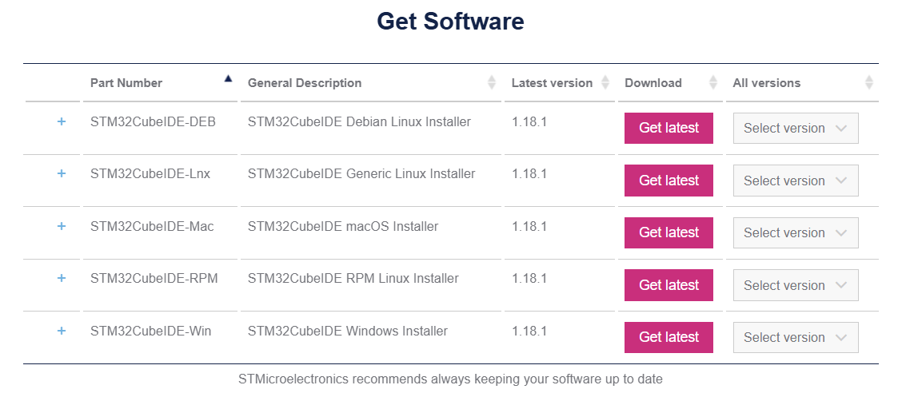
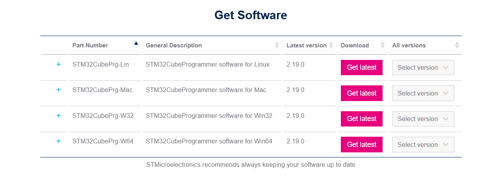
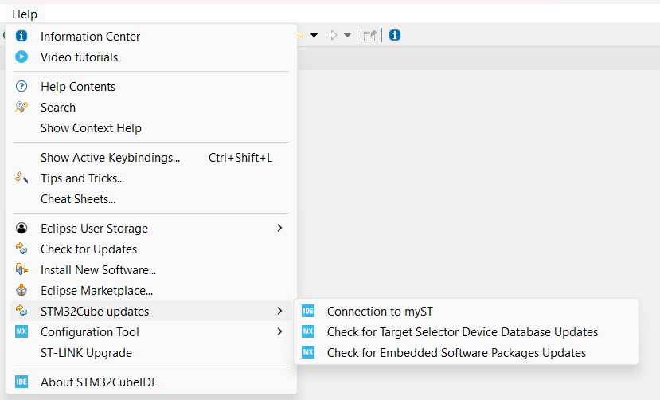
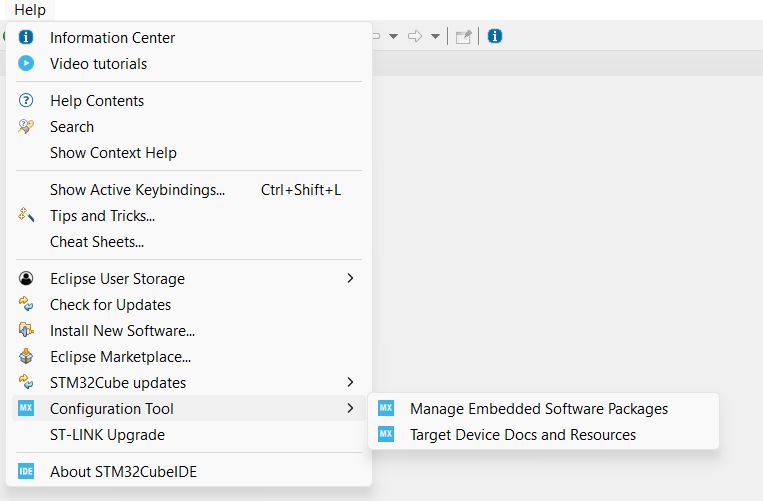
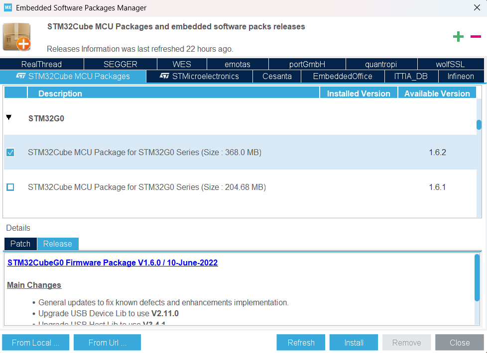
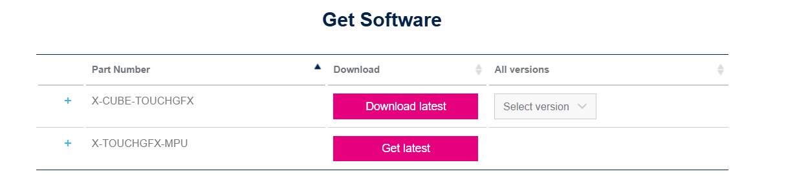
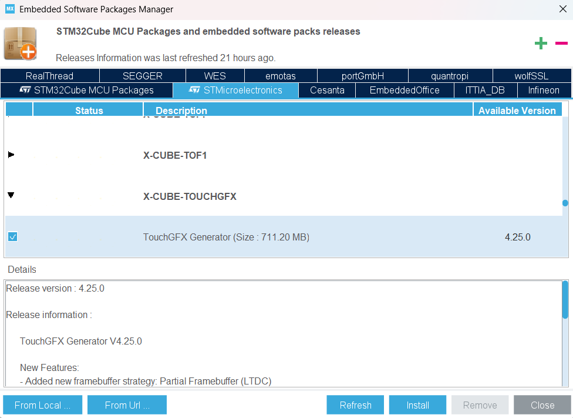

# STM32CubeIDE Kurulumu

STM32CubeIDE, STM32 mikrodenetleyicileri ve mikroişlemcileri için gerekli çevresel yapılandırmaların yapılmasını, kod oluşturma ve derlemeyi, kodun hata ayıklama işlemlerini ve cihaza yüklenmesini sağlayan Eclipse tabanlı bir C/C++ geliştirme platformudur.

## 1-STM32CubeIDE İndirme ve Kurulum
Öncelikle [buradan](https://www.st.com/en/development-tools/stm32cubeide.html#get-software) STM32CubeIDE'nin en son versiyonunu indiriniz. Aşağıdaki seçenekler arasından işletim sisteminize uygun olanı indirip kurulumunu gerçekleştirin. İndirme işlemini gerçekleştirmek için lisans sözleşmesini onaylamanız ve myST hesabı oluşturup giriş yapmanız gerekmektedir.

  

 

**NOT 1:** Kurulum yapacağınız hedef klasör yolunda Türkçe karakter ve boşluk olmadığına dikkat ediniz.

**NOT 2:** Kurulum sırasında ST-LINK ve SEGGER J-Link sürücülerinin yüklenip yüklenmeyeceği sorulacaktır. Bu sürücüleri seçip yükleme işlemlerine devam ediniz.

## 2-STM32CubeProgrammer Kurulumu  

STM32CubeProgrammer, STM32 mikrodenetleyicileri programlama ve konfigürasyonlarını ayarlamak için tasarlanmış grafiksel bir araçtır.
Öncelikle buradan STM32CubePrg 2.19.0 (son sürüm) versiyonunu indiriniz. Aşağıdaki seçenekler arasından işletim sisteminize uygun olanı indirip kurulumunu gerçekleştirin. İndirme işlemini gerçekleştirmek için lisans sözleşmesini onaylamanız ve myST hesabınıza giriş yapmış olmanız gerekmektedir.

  

 

## 3-Software Paketlerinin Kurulumu
Öncelikle STM32CubeIDE'yi başlatıyoruz. Paketlerin kurulumu işlemi için mySt hesabının girilmesi gerekmektedir. Bunun için Help sekmesinin altındaki STM32Cube updates seçeneğinin yanından Connection to myST seçeneğinin seçilmesi gerekmektedir.

  

 

Ardından açılan ekranda Enter myST account information seçeneğine tıklayın Ve hesabınıza giriş yapın.

**STM32G0 Paketinin Kurulumu**

Uygulamalarda STM32G0 ailesinden bir mikrodenetleyici kullanılacağı için G0 paketlerinin indirilmesi gereklidir.

STM32CubeIDE uygulaması içerisinde Help sekmesi altında Configuration Tools seçeneğinin yanındaki Manage Embedded Software Packages seçeneğine tıklayınız.

  

 

Ardından STM32Cube MCU Packages sekmesi altında STM32G0 yazılım paketinin en son sürümününü indiriniz.

  

 

# TouchGFX Kurulumu

Bu dokümanda, TouchGFX Designer ve gerekli araçların nasıl kurulacağını adım adım anlatacağız.

**TouchGFX Nedir?**

TouchGFX, STM32 mikrodenetleyiciler için grafik arayüzler (GUI) tasarlamaya yarayan bir yazılımdır. Bu yazılım, sürükle-bırak yöntemiyle görsel elemanlar ekleyerek dokunmatik ekranlı uygulamalar geliştirmeyi kolaylaştırır.

## TouchGFX İndirme ve Kurulum

### TouchGFX Designer’ı Kurmak:

TouchGFX arayüzlerini (GUI) geliştirmek ve tasarlamak için TouchGFX Designer adlı ayrı bir yazılımı indirmen ve kurman gerekir. STM32CubeIDE'nin kendisi sadece yazılım paketini sağlar, ancak grafik arayüz tasarımlarını oluşturmak için TouchGFX Designer aracı gereklidir.

Öncelikle [buradan](https://www.st.com/en/embedded-software/x-cube-touchgfx.html) X-CUBE-TOUCHGFX'in en son versiyonunu indiriniz.
İndirme işlemini gerçekleştirmek için lisans sözleşmesini onaylamanız ve myST hesabı oluşturup giriş yapmanız gerekmektedir.

  

 

Daha sonra indirilen zip dosyasının içerisindeki Utilities klasöründe bulunan kurulum dosyasını çalıştırıyoruz.

### TouchGFX Yazılım Paketi Kurulumu:

Öncelikle STM32CubeIDE programını başlatınız. Açılan STM32CubeIDE uygulaması içerisinde Help sekmesi altında Configuration Tools seçeneğinin yanındaki Manage Embedded Software Packages seçeneğine tıklayınız.

  

 

Daha sonra açılan pencerede STMicroelectronics kısmına giriyoruz ve TouchGFX Generator yazılım paketinin son sürümünü indiriyoruz.
 

  

 

**Gerekli Kurulumlar Tamamlanmıştır.**

