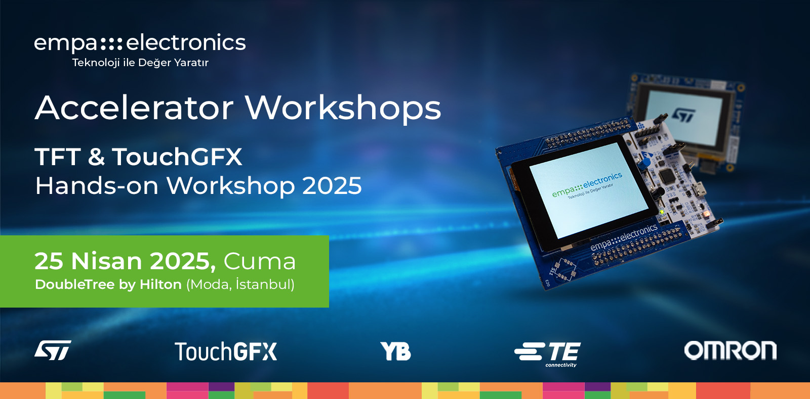

    

## Accelerator Workshops'a Hoşgeldiniz!

**Merhaba!**

Empa Elektronik tarafından düzenlenen Accelerators Workshops serimizin "TFT & TouchGFX Çalıştayı" adımına hoşgeldiniz. Bu açık-kaynak repository, workshop etkiliğimizde kullanabileceğiniz tüm gereksinimleri edinebilmeniz ve aktivitelere kolaylıkla eşlik edebilmeniz için sizinle paylaşılmıştır.

## TFT Ekranlar & TouchGFX

TFT (Thin-Film Transistor) ekranlar, modern gömülü sistemlerde kullanıcı arayüzlerinin oluşturulmasında sıkça tercih edilen yüksek kaliteli görsel bileşenlerdir. Bu ekranlar, özellikle renkli grafik desteği, geniş görüş açıları ve hızlı tepki süreleri ile öne çıkar. TFT ekranların mikrodenetleyicilerle etkin bir şekilde kullanılabilmesi için, grafik arayüzlerin verimli ve görsel olarak zengin şekilde çizilebilmesini sağlayan yazılımlara ihtiyaç duyulur. Bu noktada TouchGFX, STM32 mikrodenetleyici ailesi için optimize edilmiş, donanım hızlandırmalı grafik uygulamaları geliştirmeye olanak tanıyan güçlü bir grafik kütüphanesidir.

TouchGFX, düşük bellek kullanımıyla çalışan cihazlarda bile yüksek performanslı ve akıcı kullanıcı arayüzleri oluşturulmasını mümkün kılar. Sürükle-bırak destekli kullanıcı arayüzü tasarımı, donanım üzerinde doğrudan simülasyon imkanı ve STM32 Cube ekosistemiyle tam entegrasyon sayesinde, geliştiricilerin prototipten ürüne geçiş sürecini hızlandırır. Bu nedenle, özellikle endüstriyel kontrol panelleri, medikal cihazlar, ev elektroniği ve IoT tabanlı etkileşimli sistemlerde TFT & TouchGFX kombinasyonu, modern ve kullanıcı dostu arayüzlerin temel yapı taşlarından biridir.

## Demo İçerikleri

### Demo 1: Kahve Makinesi

Bu demoda, bir TFT ekran üzerinden kontrol edilen kahve makinesi arayüzü sunulmaktadır. Kullanıcı, farklı kahve türlerinin yanı sıra kendi özel kahvesini oluşturmak için malzeme ve oranları seçebilmektedir.

## Demo 2 : Basketbol Oyunu

Bu uygulama, TouchGFX kullanılarak hazırlanmış basit ama eğlenceli bir basketbol oyunudur. Kullanıcı ekrana dokunarak topu potaya atmaya çalışır. Bu demo, animasyonların, çarpışma algılamalarının ve oyun mekaniklerinin gömülü sistemlerde nasıl uygulanabileceğini göstermektedir.

## Demo 3: TouchGFX Başlangıç Eğitimi

Bu bölümde, TouchGFX Designer ortamı tanıtılarak temel proje yapısı, ekran tasarımı ve basit etkileşimlerin nasıl oluşturulacağı adım adım gösterilecektir. Katılımcılar kendi ilk arayüz uygulamalarını geliştirerek temel konseptleri öğrenme fırsatı bulacaktır.

## Ekstra Uygulama: External Loader Hazırlama

Bazı TouchGFX projelerinde, grafik kaynaklarının dış bellekten (external flash) okunabilmesi için özel bir yükleyici (external loader) gerekmektedir. Bu bölümde, STM32CubeProgrammer ile uyumlu bir external loader’ın nasıl oluşturulacağı ve bu loader’ın TouchGFX projesine nasıl entegre edileceği adım adım gösterilecektir.

[Buradan](Kurulum.md), tüm kurulum adımlarını detaylı bir şekilde bulabilirsiniz.
