# TouchGFX’e İlk Adım: Butonlu Sayaç Uygulaması

Bu demoda, STM32 Nucleo kartı ve TouchGFX kullanarak basit bir sayaç uygulaması yapacağız. Nucleo’nun üzerindeki butona bastığımızda ekrandaki sayaç artacak. Ekranda bir de reset butonumuz var, ona bastığımızda sayaç sıfırlanacak. Ayrıca, TouchGFX Designer'da Interactions kısmını kullanarak ekstra kod yazmadan ekran geçişi yapmayı da göstereceğiz.

Kısacası hem fiziksel butonla hem de ekrandaki butonlarla etkileşim kurduğumuz, GUI ve donanım tarafını birleştiren sade ama öğretici bir demo hazırladık.

<div align="center">
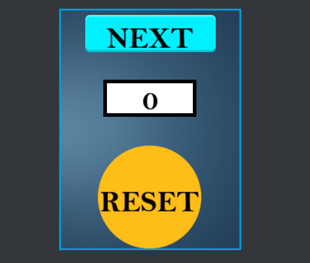
</div>
<br />

## Adım 1: TouchGFX Projesini Başlatma

1- Bu workshopta kullanacağımız kart için önceden oluşturulmuş boş bir proje dosyası kullanacağız. Boş proje dosyasına [buradan](Project_TouchGFX_Tutorial/) ulaşabilirsiniz. 

   <div align="center">
    
    </div>
   <br />

2- Bu projenin içinde, arayüz tasarımını gerçekleştireceğimiz TouchGFX klasörü yer almakta ve bu klasör içerisinde .touchgfx uzantılı tasarım dosyası bulunmaktadır.

   <div align="center">
    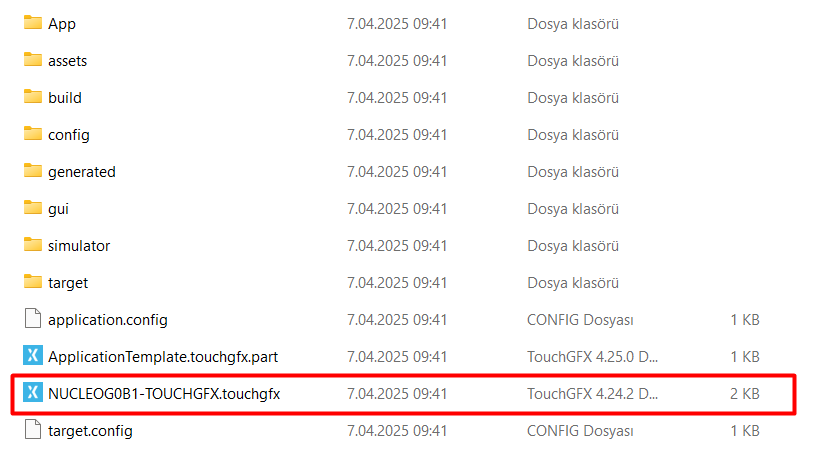
    </div>
   <br />

3- Bu dosyaya çift tıklayarak ya da sağ tıklayıp “TouchGFX Designer ile Aç” diyerek projeyi başlatıyoruz.

   <div align="center">
    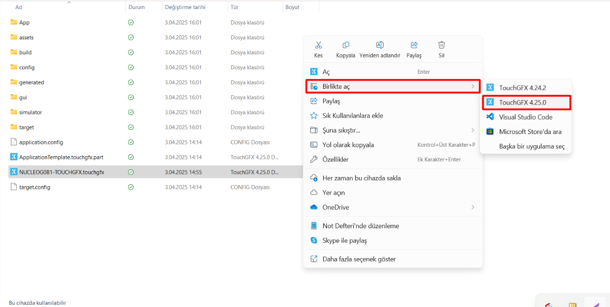
    </div>
   <br />

4- Böylece grafik arayüzümüzü tasarlayacağımız TouchGFX Designer ekranı açılmış oluyor.

   <div align="center">
    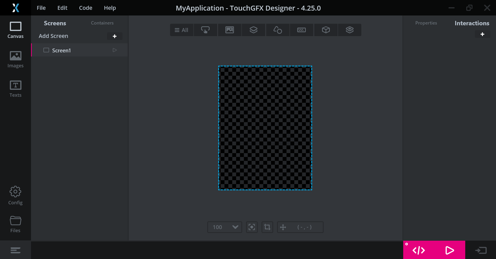
    </div>
   <br />

## Adım 2: Arayüz Tasarımını Yapmak


1- İlk olarak arkaplan görseli ekleyerek başlıyoruz. Widget Panel'den Images alanından image öğesini ekliyoruz.

   <div align="center">
    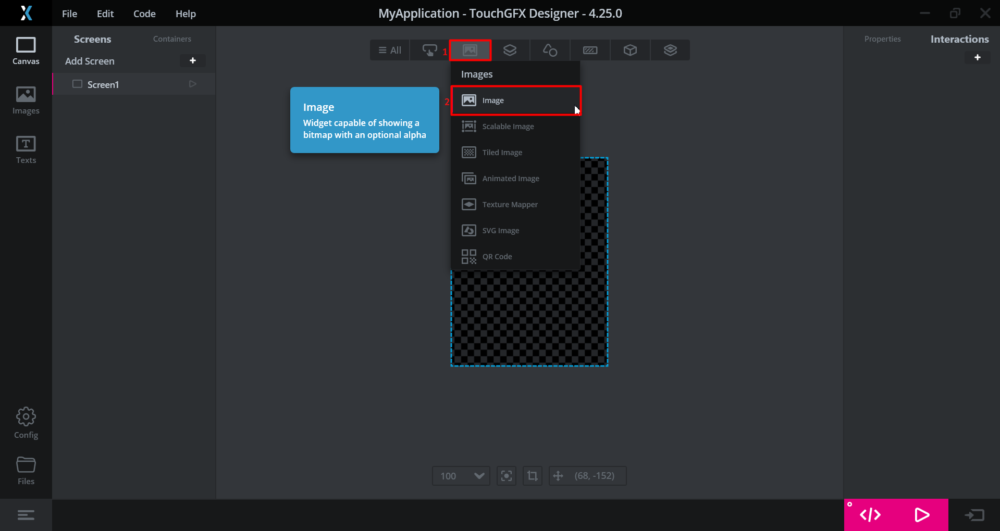
    </div>
   <br />

2- Image ekledikten, ekranın sağ tarafındaki 'Properties' (özellikler) bölümünden arka planı seçiyoruz.

   <div align="center">
    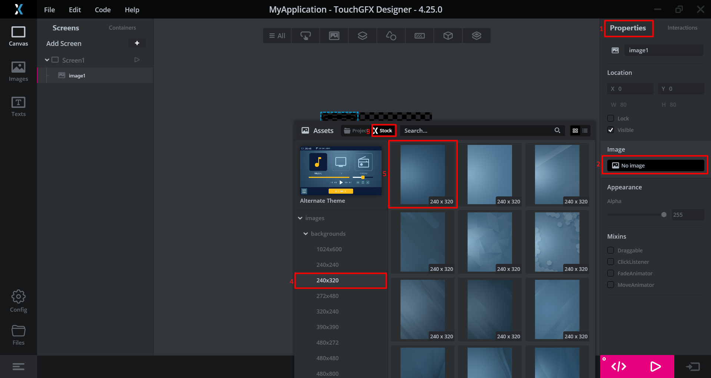
    </div>
   <br />

3- Daha sonra  Widget Panel'den Shapes alanından Box With Border öğesini ekliyoruz ve ekrana uygun bir şekilde yerleştiriyoruz.

   <div align="center">
    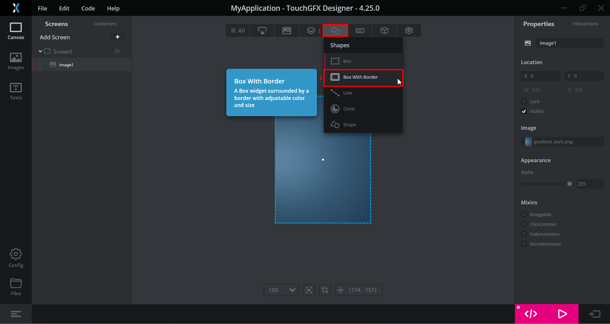
    </div>
   <br />

4- Box'u ekledikten sonra, sayaç değerini gösterecek yazıyı ekliyoruz. Bunun için yine Widget Panel'den Miscellaneous alanından 'TextArea' öğesini seçip ekran üzerine yerleştiriyoruz.

   <div align="center">
    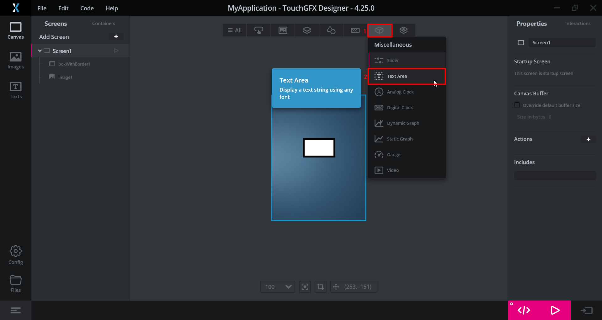
    </div>
   <br />

5- TextArea’yı ekledikten sonra, sağ taraftaki Properties bölümünden bazı ayarlar yapmamız gerekiyor.  

* İlk olarak, Translation alanına geliyoruz ve buradan bir Wildcard ekliyoruz.
  
   <div align="center">
    
    </div>
   <br />

* TextArea üzerinde varsayılan olarak yazan “New text” yazısını siliyoruz. Çünkü yazıyı dinamik olarak biz güncelleyeceğiz.
  
   <div align="center">
    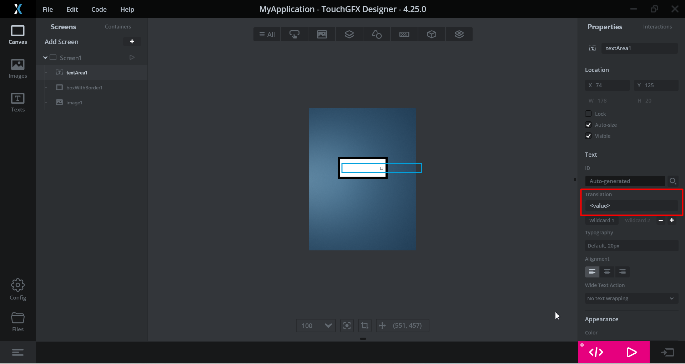
    </div>
   <br />

* Ardından bir ID ekliyoruz ve ilk değerini 0000 olarak giriyoruz. Wildcard’ın Buffer Size kısmı 10 olarak kalabilir. 

   <div align="center">
    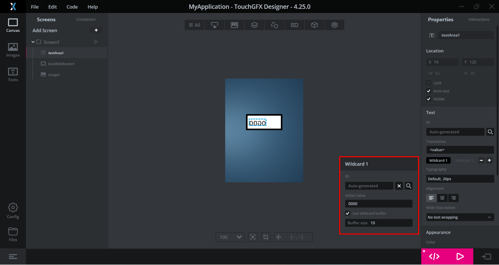
    </div>
   <br />

* Sol tarafta yer alan Text sekmesine tıklıyoruz ve yeni bir Typography ekliyoruz. Bu Typography için Font size’ı 40 olarak ayarlıyoruz. Wild Ranges kısmına 0-9 aralığını giriyoruz (çünkü sadece rakam göstereceğiz).

   <div align="center">
    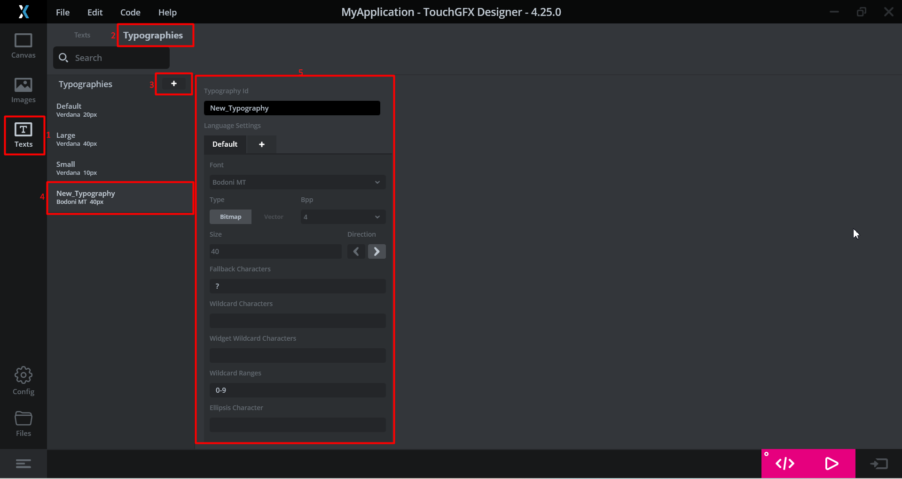
    </div>
   <br />


* Daha sonra tekrar Canvas (tasarım ekranına) dönüyoruz ve TextArea bileşeni için az önce oluşturduğumuz Typography’i seçiyoruz.

   <div align="center">
    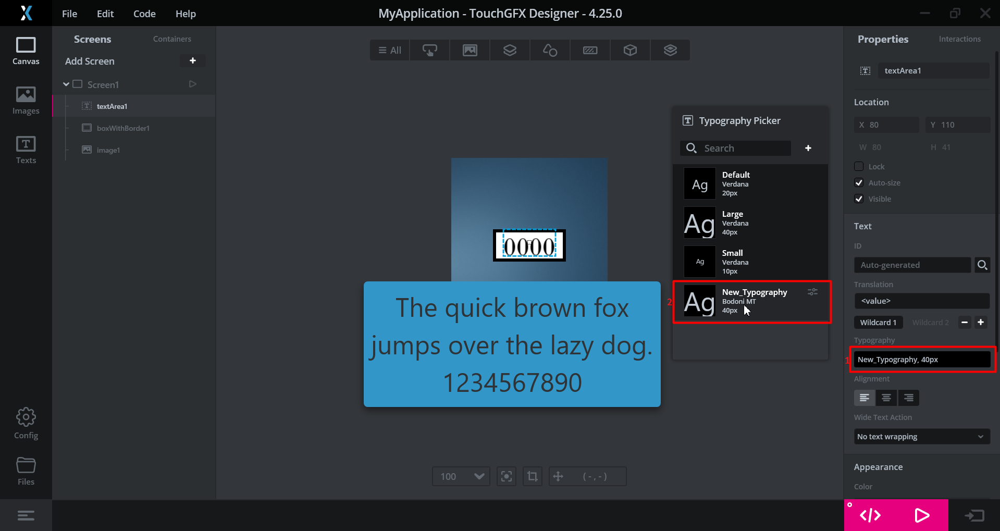
    </div>
   <br />

6- Şimdi Reset Butonunu Ekleyelim.

* Widget Panel üzerinden Button with Label öğesini sürükleyip ekranımıza bırakıyoruz.

   <div align="center">
    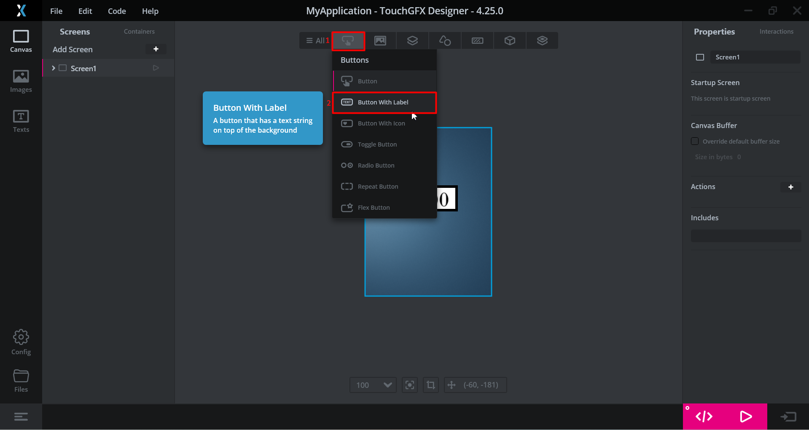
    </div>
   <br />

* Sağ taraftaki Properties panelinden, butonun boyutlarını kendi ekran tasarımımıza uygun şekilde ayarlıyoruz (138x138 boyutlarında ve round (yuvarlak) olacak şekilde).

   <div align="center">
    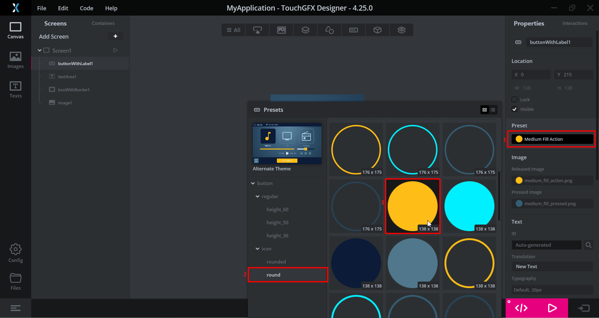
    </div>
   <br />

* Butonun üzerinde görünen yazıyı değiştirmek için, Label kısmındaki yazıyı "Reset" olarak güncelliyoruz.

   <div align="center">
    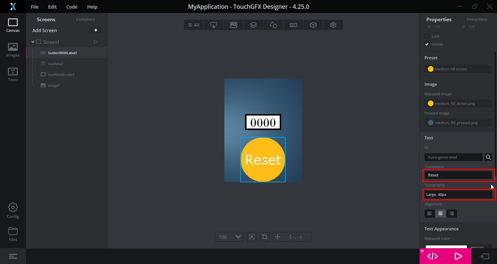
    </div>
   <br />

* Reset butonuna etkileşim eklemek için üst menüden Interactions sekmesine tıklıyoruz. Açılan pencerede, Trigger (Tetkileyici) kısmını "Button is clicked" olarak seçiyoruz. Hemen altındaki listeden ekrana eklediğimiz Reset butonunu seçiyoruz. Action (Eylem) kısmından "Call new virtual function" seçeneğini işaretliyoruz. Son olarak fonksiyonumuza resetCounter ismini veriyoruz.

   <div align="center">
    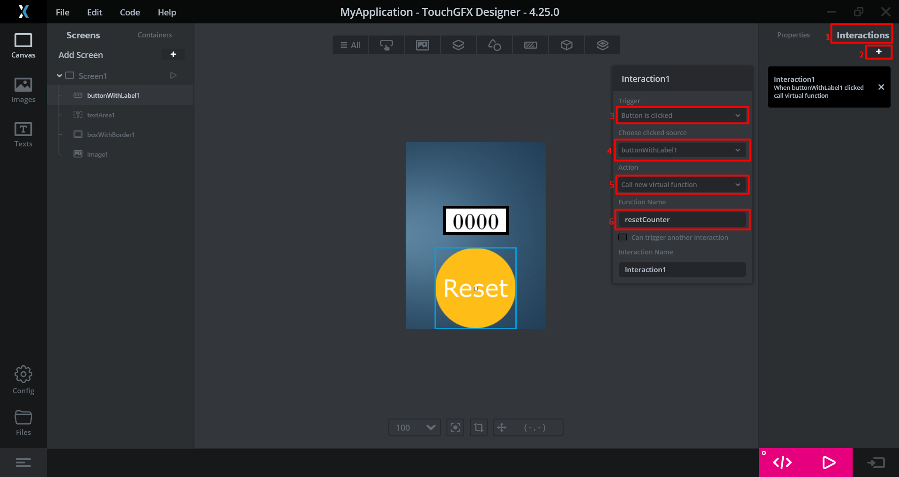
    </div>
   <br />

7- İkinci bir yeni ekran ekleyelim.
* Yeni bir ekran eklemek için Screens alanına geliyoruz ve burada bulunan Add Screen butonuna basarak yeni bir ekran oluşturuyoruz. 

   <div align="center">
    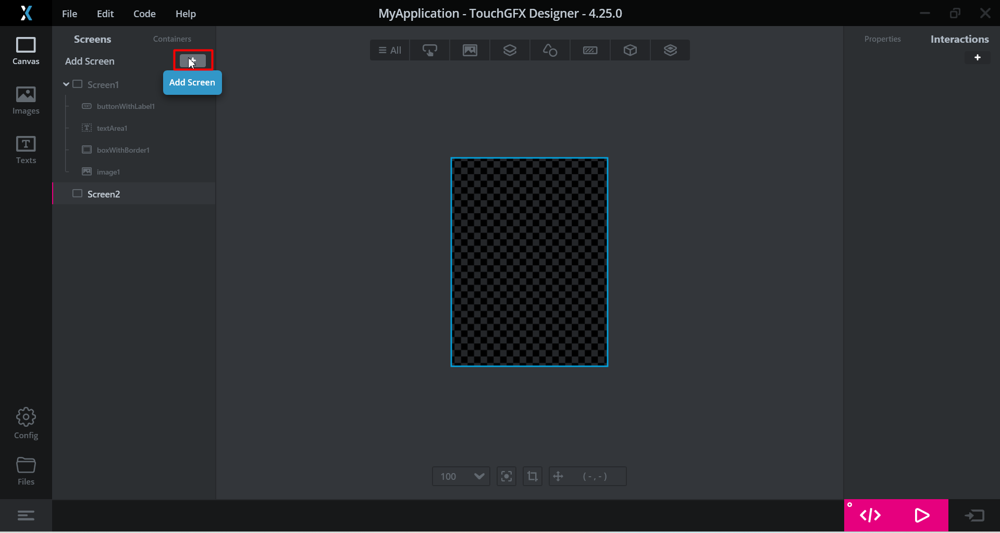
    </div>
   <br />

* Ekran eklendikten sonra, bu yeni ekrana geçiyoruz ve ekrana bir adet Image (Görüntü) öğesi ekliyoruz. 

   <div align="center">
    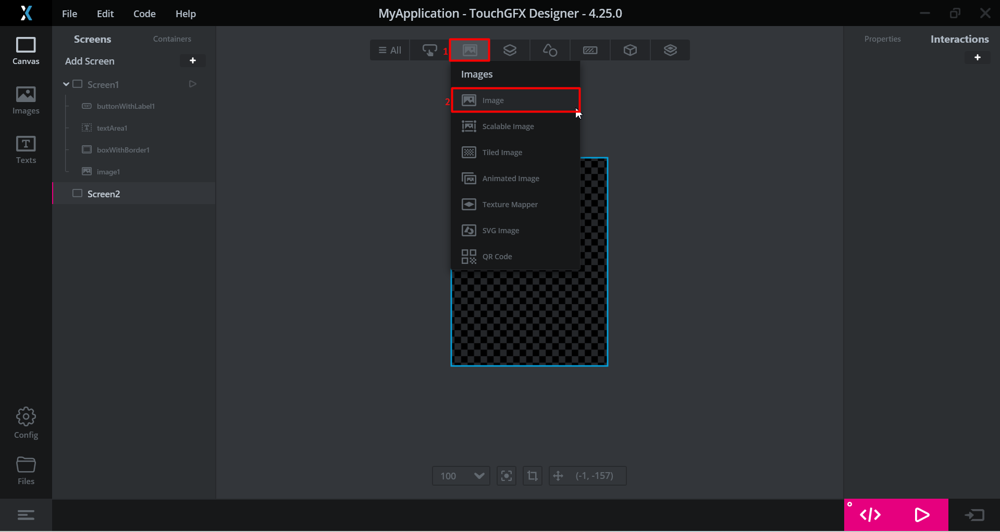
    </div>
   <br />

*  Image ekledikten, ekranın sağ tarafındaki 'Properties' (özellikler) bölümünden arka planı seçiyoruz.

   <div align="center">
    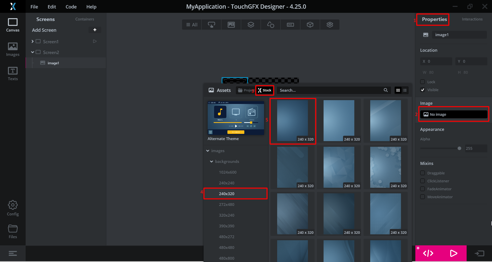
    </div>
   <br />

* Önceki ekrana geri dönebilmek için, yeni ekrana Widget Panel üzerinden bir Button with Label öğesi ekliyoruz.
  
   <div align="center">
    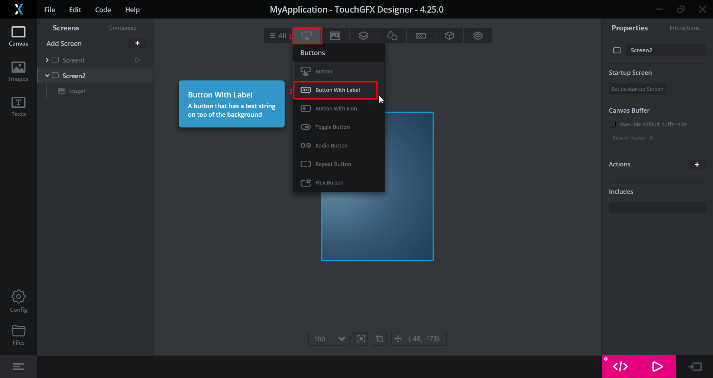
    </div>
   <br />

* Eklediğimiz butonun üzerine tıklayarak, Label (Etiket) kısmındaki yazıyı Back olarak değiştiriyoruz ve butonun biçimini uygun bir şekilde değiştiriyoruz

   <div align="center">
    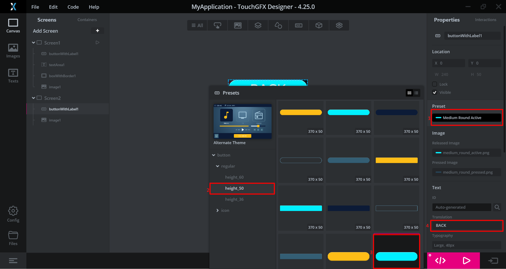
    </div>
   <br />

* Daha sonra Interactions bölümüne geçiyoruz. 

    * Trigger olarak Button is clicked seçiyoruz.
    * Ardından az önce eklediğimiz Back butonunu seçiyoruz.
    * Action olarak Change Screen seçiyoruz.
    * Geçiş yapacağımız ekranı Screen1 olarak seçiyoruz. 
    * Transition kısmında Slide efektini belirliyoruz.
    * Transition Direction ise East olacak şekilde ayarlanıyor.

   <div align="center">
    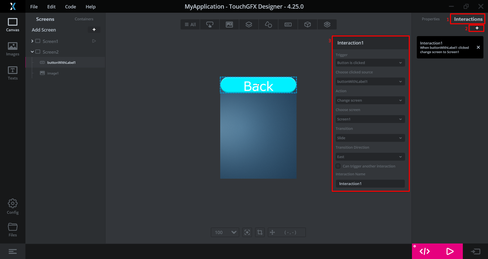
    </div>
   <br />

8- İlk ekranımıza ekran geçiş butonu ekleyelim.
* Ekran geçişi için kullanacağımız butonu eklemekle başlıyoruz. Bunun için, Widget Panel’den Button with Label öğesini sahneye ekliyoruz.

   <div align="center">
    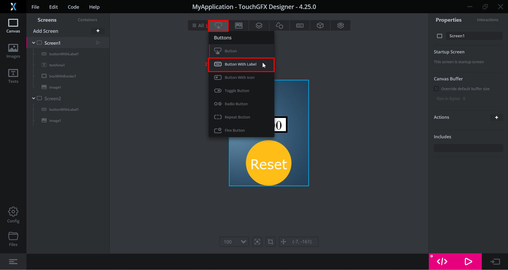
    </div>
   <br />

* Ardından, sağ taraftaki Properties > Present sekmesinden butonun ölçülerini ekranımıza uygun şekilde seçiyoruz. Son olarak, butonun üzerindeki yazıyı Next olarak değiştiriyoruz.,

   <div align="center">
    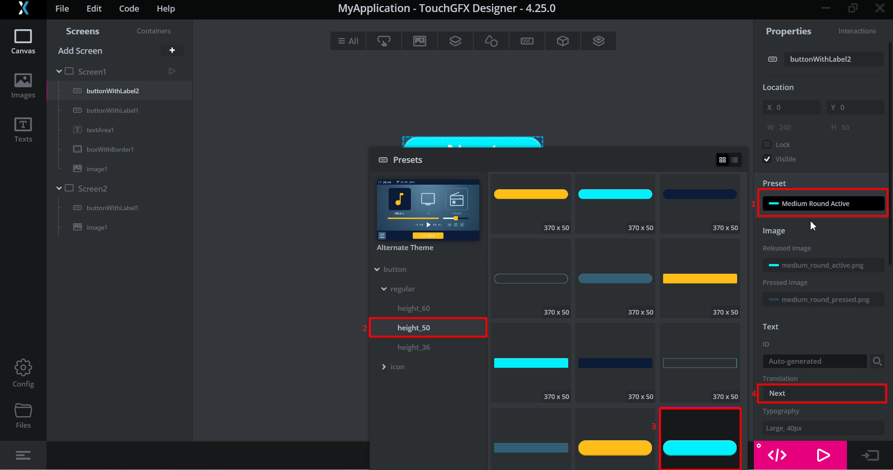
    </div>
   <br />

* Daha sonra Interactions bölümüne geçiyoruz. 

    * Trigger olarak Button is clicked seçiyoruz.
    * Ardından az önce eklediğimiz Next butonunu seçiyoruz.
    * Action olarak Change Screen seçiyoruz.
    * Geçiş yapacağımız ekranı Screen2 olarak seçiyoruz. 
    * Transition kısmında Slide efektini belirliyoruz.
    * Transition Direction ise West olacak şekilde ayarlanıyor.

   <div align="center">
    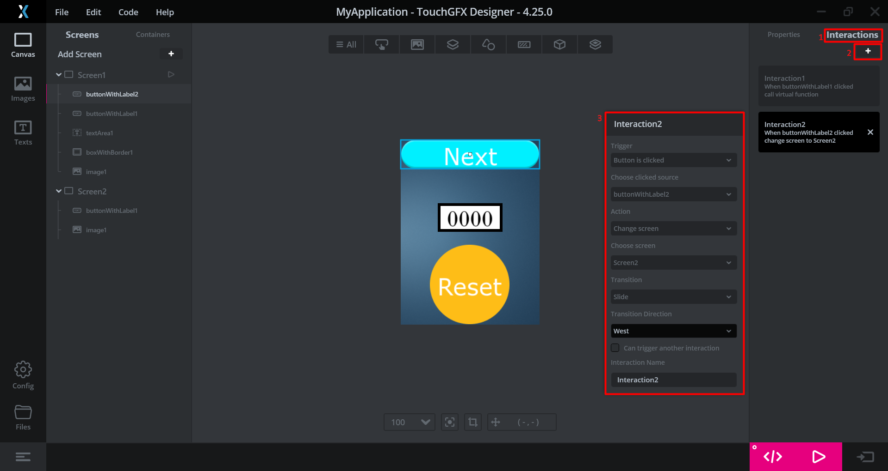
    </div>
   <br />

9- Arayüz tasarımımızı tamamladık. Şimdi projemizi oluşturmak için TouchGFX Designer'da sağ üst köşede bulunan "Generate" butonuna tıklıyoruz. Generate butonuna bastıktan sonra TouchGFX, arayüz tasarımımızı STM32CubeIDE ile uyumlu hale getirecek ve gerekli dosyalar otomatik olarak oluşturulacaktır.

   <div align="center">
    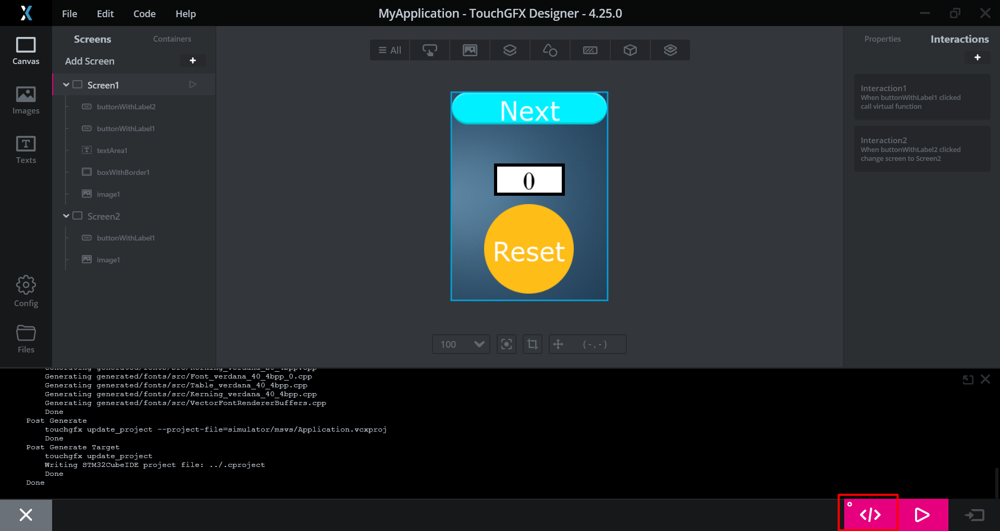
    </div>
   <br />

## Adım 3: STM32CubeIDE Üzerinde Kodları Yazmak
Arayüz tasarımını tamamladıktan sonra artık yazılım kısmına geçiyoruz. Bu bölümde fiziksel (hardware) bir butona basıldığında, ekrandaki sayaç değerini nasıl artıracağımızı öğreneceğiz. Bu işlemleri yaparken MVP (Model - View - Presenter) mimarisinden faydalanacağız.

TouchGFX projelerinde, ekranla etkileşime geçmek için MPV (Model-View-Presenter) yapısı kullanılır. Bu yapı 3 temel parçadan oluşur:

- Model: Donanım tarafıyla ilgilenir. Butonlardan gelen veriler burada işlenir. Sayaç gibi veriler burada tutulur ve güncellenir.

- View: Kullanıcının gördüğü ekrandır. Görsel bileşenler (text, button, vs.) burada yer alır.

- Presenter: View ile Model arasında köprü görevi görür. Model’den gelen verileri View’a aktarır, View’dan gelen istekleri Model’e yönlendirir.

Butonla sayaç değerini artırmak istediğimizde:

* Buton durumu Model içinde okunur.
  
* Presenter, bu değişen değeri View'a iletir.
  
* View, gelen değeri ekrana yansıtır.

Şimdi adım adım kodumuzu yazalım.  

1- Proje dosyasından .project uzantılı STM32CubeIDE dosyasını açıyoruz. Bu dosya, STM32CubeIDE'yi kullanarak projeyi açmamızı sağlar.

   <div align="center">
    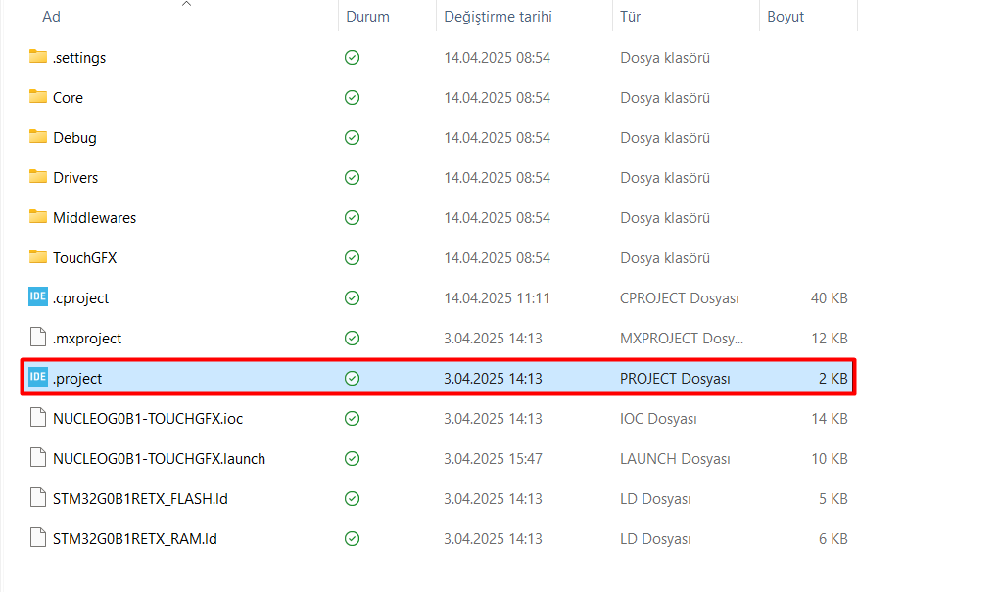
    </div>
   <br />

2- Projemiz açıldıktan sonra TouchGFX/gui/src/model/Model.cpp dosyasına gidiyoruz. Burada donanım ile ilgili işlemleri gerçekleştireceğimiz kodları yazacağız.

* Aşağıdaki gibi Model.cpp dosyasına gerekli başlık dosyasını ekliyoruz (diğer başlık dosyalarının altına ekleyebiliriz).

   ```c
   #include "main.h" 
   ```

* Ardından, buton pinini tanımlamak için pin ve port bilgilerini ekliyoruz (başlık dosyalarından sonra ekleyebiliriz).

   ```c
   #define BUTTON_PIN GPIO_PIN_13
   #define BUTTON_PORT GPIOC
   ```

* Model sınıfının yapıcısında, counterplus, prevButtonState ve currentButtonState değişkenlerinin ilk değerlerini başlatmak için, modelListener(0) ifadesinin yanına virgülle ekliyoruz.

   ```c
   Model::Model() : modelListener(0),counterplus(0),prevButtonState(false),currentButtonState(false) 
   {

   }
   ```

* TouchGFX framework’ü tarafından her frame’de çağrılan tick() fonksiyonunu, butona basıldığında sayacı artıracak şekilde aşağıdaki gibi tanımlıyoruz (Model.cpp de bulunan tick() foksiyonunun üzerine yazıyoruz bunu).

   ```c
   void Model::tick()
   {
      bool currentButtonState = HAL_GPIO_ReadPin(BUTTON_PORT, BUTTON_PIN) == 0; 

      if (currentButtonState && !prevButtonState) {
         counterplus++;
      }

      prevButtonState = currentButtonState;

      modelListener->upCounter(counterplus);
   }
   ```

* Sayacı sıfırlamak için aşağıdaki fonksiyonu Model sınıfına ekliyoruz. Bu fonksiyon, dışarıdan bir değer alır ve bu değeri sayaca atar. Eğer 0 değeri verilirse, sayaç sıfırlanır.

   ```c
   void Model::setCounter(int value)
   {
      counterplus = value;
   }
   ```

3-Bu adımda, sayaç değerini ve buton durumunu saklamak için bazı değişkenleri TouchGFX/gui/include/gui/model/Model.hpp dosyasına ekliyoruz. Ayrıca, bu verileri işleyecek fonksiyon prototiplerini de ekliyoruz.

* public kısmına aşağıdaki fonksiyon prototipini ekliyoruz.
   ```c
   void setCounter(int value);
   ```

* Protect kısmına aşağıdaki değişkenleri ekliyoruz.

   ```c
   int counterplus;
   bool currentButtonState;
   bool prevButtonState;
   ```

4-Bu adımda, Model tarafından güncellenen sayaç değerini Presenter'a iletebilmek için TouchGFX/gui/include/gui/model/ModelListener.hpp dosyasının public kısmına upCounter fonksiyonunu ekliyoruz.

   ```c
   virtual void upCounter( int counterplus){};
   ```

5-Bu adımda, Presenter sınıfında, Model tarafından güncellenen sayaç değerini View'a iletecek fonksiyonları ekliyoruz.TouchGFX/gui/src/screen1_screen/Screen1Presenter.cpp dosyasına aşağıdaki iki fonksiyonu ekliyoruz.

   ```c
   void Screen1Presenter::upCounter(int counterplus)
   {
      view.upCounter(counterplus);
   }

   void Screen1Presenter::setCounter(int value)
   {
      model->setCounter(value);
   }
   ```

6-Bu adımda, bir önceki adımda Screen1Presenter.cpp dosyasına eklediğimiz fonksiyonların prototiplerini, TouchGFX/gui/include/gui/screen1_screen/Screen1Presenter.hpp dosyasında public kısmına ekliyoruz.  

   ```c
   virtual void upCounter(int counterplus);
   void setCounter(int value);
   ```

7-Bu adımda, View sınıfında sayaç değerini ekranda gösterecek ve sıfırlayacak fonksiyonları TouchGFX/gui/src/screen1_screen/Screen1View.cpp dosyasına ekliyoruz.

* Öncelikle, constructor (yapıcı fonksiyon) içinde counter değişkenini 0 olarak başlatıyoruz.
* 
   ```c
   Screen1View::Screen1View(): resetNum(0)
   {

   }
   ```
* Ardından, sayaç değerini güncellemek ve ekranda göstermek için upCounter() fonksiyonunu, sayacı sıfırlamak için ise resetCounter() fonksiyonunu ekliyoruz.
  
   ```c
   void Screen1View::upCounter(int number)
   {
      Unicode::snprintf(textArea1Buffer,TEXTAREA1_SIZE,"%u",number);
      textArea1.invalidate();
   }

   void Screen1View::resetCounter()
   {
      presenter ->setCounter(resetNum);
      Unicode::snprintf(textArea1Buffer,TEXTAREA1_SIZE,"%u",resetNum);
      textArea1.invalidate();
   }
   ```

8-Bu adımda, Screen1View sınıfına ait fonksiyon prototiplerini ve sayaç değişkenini tanımlıyoruz. Bunun için TouchGFX/gui/include/gui/screen1_screen/Screen1View.hpp dosyasına aşağıdakileri ekliyoruz.

* public kısmına aşağıdaki fonksiyon prototiplerini ekliyoruz.
   ```c
   virtual void upCounter(int number);
   virtual void resetCounter();
   ```

* Protect kısmına aşağıdaki değişkenleri ekliyoruz.

   ```c
   uint16_t resetNum;
   ```

## Adım 4: Projeyi STM32 Kartına Yükleme

1- Geliştirme kartını bilgisayarınıza bağlayın.

2-“Run” butonuna tıklayarak (yeşil ok), kodları STM32 kartınıza yükleyin.

   <div align="center">
    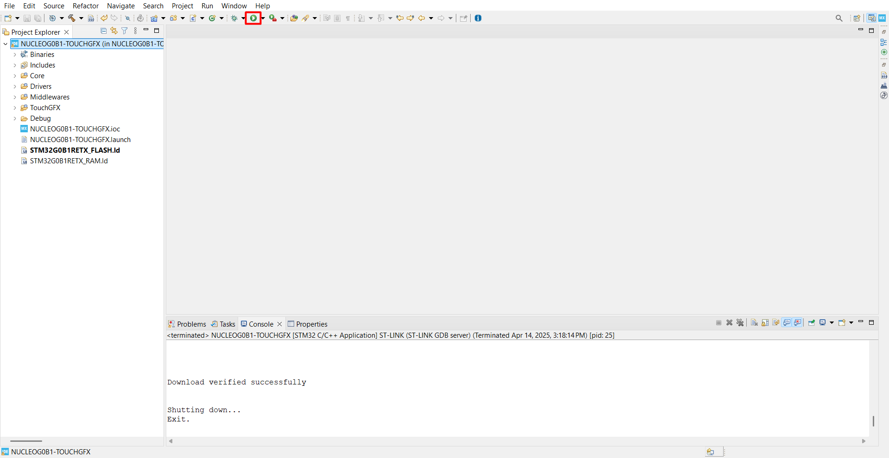
    </div>
   <br />

**Proje karta başarıyla yüklendi, artık test etmeye hazırsınız.**